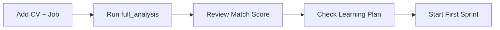

# Complete Setup Guide: Using Python Script + GitHub Workflow

## 📁 Repository Structure

```
your-repo/
├── .github/
│   └── workflows/
│       └── reverse-engine.yml          # GitHub Actions workflow
├── src/
│   └── python_advanced_job_engine.py   # Main Python script
├── data/
│   ├── my_cv.txt                       # Your CV (you create this)
│   ├── my_cv.pdf                       # OR PDF version
│   └── target_job.txt                  # Job description (you create this)
├── job_search_data/                    # Auto-created by script
│   ├── master_skillset.json
│   ├── learning_progress.json
│   ├── analyzed_jobs.json
│   └── workflow_state.json
├── requirements.txt                    # Python dependencies
├── README.md                          # Documentation
└── .gitignore                         # Git ignore rules
```

---

## 🚀 Step-by-Step Setup

### Step 1: Create Repository Structure

```bash
# Create the directory structure
mkdir -p .github/workflows
mkdir -p src
mkdir -p data
mkdir -p job_search_data

# Create empty placeholder files
touch data/my_cv.txt
touch data/target_job.txt
```

### Step 2: Add the Python Script

Save `python_advanced_job_engine.py` to `src/`:

```bash
# Place the script at:
src/python_advanced_job_engine.py
```

### Step 3: Add the Workflow File

Save the workflow YAML to `.github/workflows/`:

```bash
# Place the workflow at:
.github/workflows/reverse-engine.yml
```

### Step 4: Create Requirements File

Create `requirements.txt`:

```txt
PyPDF2>=3.0.0
python-docx>=0.8.11
python-dateutil>=2.8.2
```

### Step 5: Create Your CV File

Edit `data/my_cv.txt` with your actual CV:

```txt
John Doe
Software Engineer
john.doe@email.com | +1-234-567-8900

EXPERIENCE
Senior Python Developer at Tech Corp (2020-2023)
- Developed REST APIs using Django and Flask
- Implemented microservices architecture
- Led team of 5 developers

SKILLS
Languages: Python, JavaScript, SQL
Frameworks: Django, Flask, React
Tools: Docker, Kubernetes, Git
Cloud: AWS, Azure

EDUCATION
BS Computer Science, State University (2018)

CERTIFICATIONS
AWS Certified Solutions Architect
```

### Step 6: Create Job Description File

Edit `data/target_job.txt` with the job you're targeting:

```txt
Senior Machine Learning Engineer

Company: TechCorp Inc.

REQUIRED SKILLS:
- 5+ years experience in ML/AI
- Strong Python, PyTorch, TensorFlow
- AWS, Docker, Kubernetes
- MLOps experience

PREFERRED SKILLS:
- Deep Learning
- NLP
- Computer Vision
- Production ML systems

QUALIFICATIONS:
- Master's degree preferred
- Strong communication skills
```

### Step 7: Create .gitignore

Create `.gitignore`:

```gitignore
# Python
__pycache__/
*.py[cod]
*$py.class
*.so
.Python
env/
venv/
ENV/

# Job search data (contains personal info)
job_search_data/
*.json

# Personal data files
data/my_cv.txt
data/my_cv.pdf
data/my_cv.docx
data/target_job.txt
data/target_job.pdf

# Keep data directory structure but not files
!data/.gitkeep
!job_search_data/.gitkeep

# IDE
.vscode/
.idea/
*.swp
*.swo

# OS
.DS_Store
Thumbs.db

# Reports
PROGRESS_REPORT.md
export_*/
```

### Step 8: Create Placeholder Files

```bash
# Keep directory structure in git
touch data/.gitkeep
touch job_search_data/.gitkeep

# Add to git
git add data/.gitkeep
git add job_search_data/.gitkeep
```

### Step 9: Create README

Create `README.md`:

```markdown
# Reverse-Engine Job Search System

Automated job search and skill development system using sprint-based learning.

## Quick Start

1. **Add your CV**: Edit `data/my_cv.txt`
2. **Add target job**: Edit `data/target_job.txt`
3. **Run initial analysis**: Go to Actions → Run workflow → Select "full_analysis"
4. **Start learning**: Follow the generated learning plan

## Workflow Actions

- `full_analysis` - Analyze CV vs Job, create learning plan
- `start_sprint` - Begin a 2-week learning sprint
- `end_sprint` - Complete sprint and assess progress
- `daily_report` - View current progress
- `quality_check` - Check quality gates

## Local Usage

```bash
# Install dependencies
pip install -r requirements.txt

# Run script locally
python src/python_advanced_job_engine.py
```

## File Formats Supported

- ✅ `.txt` - Plain text
- ✅ `.pdf` - PDF documents (requires PyPDF2)
- ✅ `.docx` - Word documents (requires python-docx)
```

---

## 💻 Using the System

### Option 1: Use GitHub Actions (Recommended)

#### Initial Analysis

1. Go to your repo on GitHub
2. Click **"Actions"** tab
3. Click **"Reverse-Engine Job Search"** workflow
4. Click **"Run workflow"** button
5. Select options:
   - **Action**: `full_analysis`
   - **CV path**: `data/my_cv.txt`
   - **Job path**: `data/target_job.txt`
6. Click **"Run workflow"**

#### View Results

1. Wait for workflow to complete (green checkmark)
2. Click on the workflow run
3. Click **"📊 Generate Daily Progress Report"** step
4. Scroll down to see your analysis
5. Download artifacts for detailed reports

#### Start a Sprint

1. Run workflow again
2. Select **Action**: `start_sprint`
3. Check the output for your sprint goals

#### Daily Logging

1. Run workflow
2. Select **Action**: `log_daily`
3. Enter:
   - Hours: `3.5`
   - Concepts: `PyTorch basics, Docker containerization`
   - Notes: `Completed first tutorial`

#### End Sprint

1. Run workflow
2. Select **Action**: `end_sprint`
3. Provide:
   - **project_url**: Your GitHub project URL
   - **test_scores**: `{"PyTorch": 75, "Docker": 80}`

---

### Option 2: Use Locally

#### Run the Script Locally

```bash
# Install dependencies
pip install -r requirements.txt

# Run the script
python src/python_advanced_job_engine.py
```

#### The script will:
1. Show demo mode first
2. Ask if you want to analyze your own files
3. Prompt for CV and job description paths
4. Generate complete analysis
5. Create learning plan
6. Export all materials

#### Analyze Your Own Files

```python
from src.python_advanced_job_engine import AdvancedJobEngine

# Initialize engine
engine = AdvancedJobEngine()

# Analyze from files
analysis = engine.analyze_from_files(
    cv_file='data/my_cv.txt',
    job_file='data/target_job.txt',
    job_title='Senior ML Engineer',
    company='TechCorp'
)

# Create learning plan
plan = engine.create_learning_plan(analysis, mode='reverse')

# Print results
print(f"Match Score: {analysis['score']['total_score']}%")
print(f"Missing Skills: {len(analysis['gaps']['missing_required_skills'])}")
```

#### Start Sprint Workflow

```python
# Start a sprint
sprint = engine.start_sprint(
    skills=['PyTorch', 'Docker'],
    project_goal='Build ML model with Docker deployment'
)

# Log daily progress
engine.log_daily(
    hours=3.5,
    concepts=['Neural networks', 'Docker basics'],
    notes='Great progress today'
)

# End sprint
result = engine.end_sprint(
    project_url='https://github.com/user/my-project',
    test_scores={'PyTorch': 75, 'Docker': 80}
)

# Check progress
engine.display_progress_dashboard()
```

---

## 🔄 Typical Workflow

### Week 1: Initial Analysis



1. **Monday**: Add your CV and job description files
2. **Monday**: Run `full_analysis` action
3. **Monday**: Review your match score and gaps
4. **Monday**: Run `start_sprint` action
5. **Tuesday-Friday**: Work on sprint goals
6. **Daily**: Run `daily_report` to track progress

### Week 2-3: Active Learning

1. **Daily**: Log your progress (hours, concepts)
2. **Weekly**: Check quality gates
3. **End of sprint**: Run `end_sprint` with project URL
4. **After sprint**: Review progress dashboard
5. **Start next sprint**: Continue cycle

### Month 3: Quality Gates

1. **Check gates**: Run `quality_check` action
2. **Hit 65%**: Foundation gate passed! 🎉
3. **Hit 80%**: Competency gate passed! 🎉
4. **Hit 90%**: Mastery gate passed! 🎉

### Ready to Apply

1. **Brand ready**: Polish LinkedIn, GitHub
2. **Network ready**: Connect with people
3. **Application ready**: Start applying! 🚀

---

## 📊 Understanding Your Data

### Files Created by System

#### `job_search_data/workflow_state.json`
```json
{
  "mode": "reverse",
  "current_score": 65,
  "baseline_score": 45,
  "skills_mastered": ["Python", "Docker"],
  "current_sprint": 3,
  "projects_completed": [...]
}
```

#### `job_search_data/analyzed_jobs.json`
```json
[
  {
    "job_id": "abc123",
    "job_info": {"title": "...", "company": "..."},
    "score": {"total_score": 65, ...},
    "gaps": {"missing_required_skills": [...]},
    "recommendations": [...]
  }
]
```

#### `job_search_data/learning_progress.json`
```json
[
  {
    "plan_id": "LP_abc123_20250117",
    "estimated_duration": "16-24 weeks",
    "levels": {
      "study": [...],
      "practice": [...],
      "courses": [...]
    }
  }
]
```

---

## 🐛 Troubleshooting

### Workflow Fails on Import

**Error**: `ModuleNotFoundError: No module named 'python_advanced_job_engine'`

**Fix**: Ensure file is at `src/python_advanced_job_engine.py`

### Can't Read PDF/DOCX

**Error**: `ImportError: PyPDF2 is required`

**Fix**: Workflow should auto-install. If running locally:
```bash
pip install PyPDF2 python-docx
```

### No Data Showing

**Error**: Empty dashboard

**Fix**: Run `full_analysis` first before other actions

### File Not Found

**Error**: `FileNotFoundError: data/my_cv.txt`

**Fix**: Make sure your CV file exists and path matches

---

## 🔒 Privacy & Security

### What's Tracked in Git

✅ **Tracked** (safe to commit):
- Python script (`src/`)
- Workflow file (`.github/workflows/`)
- Directory structure (`.gitkeep` files)
- Documentation (`README.md`)
- Requirements (`requirements.txt`)

❌ **Not Tracked** (in `.gitignore`):
- Your CV files (`data/my_cv.*`)
- Job descriptions (`data/target_job.*`)
- Personal data (`job_search_data/*.json`)
- Generated reports

### GitHub Actions Artifacts

- Artifacts are stored for 90 days
- Only you can access them
- Automatically deleted after retention period
- Download before they expire

### Best Practices

1. **Never commit personal info**: Keep CV and job files in `.gitignore`
2. **Use private repo**: Keep your job search private
3. **Review artifacts**: Check what's being uploaded
4. **Clean up**: Delete old artifacts you don't need

---

## 📈 Success Metrics

Track your progress:

| Metric | Target | Current |
|--------|--------|---------|
| Match Score | 90% | Check dashboard |
| Skills Mastered | 10+ | Check dashboard |
| Projects Completed | 5+ | Check dashboard |
| Sprints Completed | 6+ | Check dashboard |
| Quality Gates | All | Check dashboard |

---

## 🎯 Next Steps

1. ✅ Set up repository structure
2. ✅ Add your CV file
3. ✅ Add target job description
4. ✅ Run `full_analysis` workflow
5. ✅ Review your match score
6. ✅ Start first sprint
7. ✅ Log daily progress
8. ✅ Build projects
9. ✅ Pass quality gates
10. ✅ Apply to jobs!

---

## 💡 Pro Tips

- **Consistency**: Log daily, even if just 30 minutes
- **Real projects**: Build actual deployable projects
- **Test yourself**: Take the skill tests seriously
- **Update CV**: Keep adding new skills as you learn
- **Re-analyze**: Run full_analysis monthly to track improvement
- **Stay motivated**: Celebrate each quality gate passed!

---

## 🤝 Support

If you encounter issues:

1. Check the workflow logs in GitHub Actions
2. Review the troubleshooting section above
3. Verify file paths and structure
4. Check Python version (3.9+ required)
5. Ensure all dependencies installed

---

## 📝 Example Timeline

**Real-world example of 6-month journey:**

- **Month 1**: Score 45% → 55% (Foundation)
- **Month 2**: Score 55% → 68% (Foundation gate ✅)
- **Month 3**: Score 68% → 78% (Skill building)
- **Month 4**: Score 78% → 85% (Competency gate ✅)
- **Month 5**: Score 85% → 92% (Mastery gate ✅)
- **Month 6**: Polish brand → Application ready ✅

**Result**: Got 3 interviews, 1 job offer! 🎉

---

Good luck with your job search! 🚀

# Initial setup
gh workflow run unified-job-search.yml \
  -f action=full_analysis \
  -f cv_file=data/my_cv.pdf \
  -f job_file=data/target_job.pdf

# Start learning
gh workflow run unified-job-search.yml \
  -f action=start_sprint

# Daily logging
gh workflow run unified-job-search.yml \
  -f action=log_daily \
  -f hours=3 \
  -f concepts="React,TypeScript"

# Check progress
gh workflow run unified-job-search.yml \
  -f action=daily_report